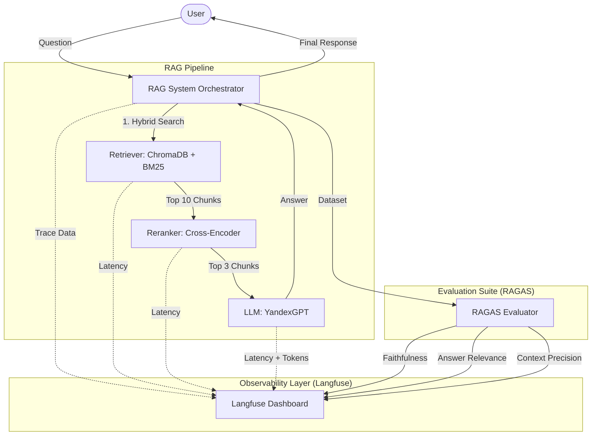

# RAG Monitoring & Observability (Project 3)

This project implements the third stage of an AI Engineer roadmap: moving a RAG (Retrieval-Augmented Generation) system from prototype to production by adding **Observability**, **Tracing**, and **Automated Evaluation**.

## 🏗️ Architecture



## 🚀 Key Features

- **End-to-End Tracing**: Integrated with **Langfuse** to capture the full lifecycle of every query.
- **Performance Monitoring**: Granular latency tracking for retrieval, reranking, and generation.
- **Cost Analysis**: Automated token counting and cost estimation per request.
- **Automated Evaluations**: Uses **RAGAS** to programmatically measure the quality of responses using LLM-as-a-judge patterns.
- **Production Ready**: Built with modular components (`rag_system.py`, `evaluator.py`, `observability.py`).

## 🛠️ Setup & Installation

1. **Clone the repository**:
   ```bash
   git clone <your-repo-url>
   cd Monitoring-Observability
   ```

2. **Create and activate a virtual environment**:
   ```bash
   python -m venv venv
   .\venv\Scripts\activate  # Windows
   source venv/bin/activate # Linux/Mac
   ```

3. **Install dependencies**:
   ```bash
   pip install -r requirements.txt
   ```

4. **Configure environment variables**:
   Create a `.env` file based on the provided template:
   ```env
   YC_API_KEY=your_yandex_key
   YC_FOLDER_ID=your_folder_id
   LANGFUSE_PUBLIC_KEY=your_public_key
   LANGFUSE_SECRET_KEY=your_secret_key
   LANGFUSE_HOST=https://cloud.langfuse.com
   ```

## 📈 Usage

- **Run the full demo**:
  ```bash
  python main.py
  ```
- **Run evaluations only**:
  ```bash
  python evaluator.py
  ```

## 📊 Results
All traces and evaluation scores are pushed to Langfuse, providing a real-time dashboard of your RAG system's health and quality.

---
*Created as part of the 5 BIG PROJECTS roadmap.*
